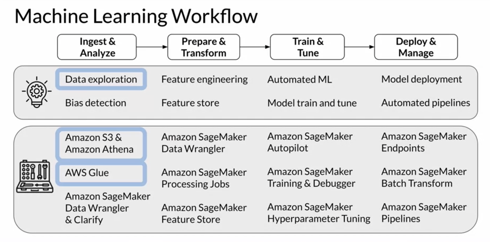

## ML workflow

## Data ingestion and exploration
Ingest data into data lakes
- Centralized and secure repository
- Store, discover and share data at any scale
  - structured relational data
  - semi-structured data
  - unstructured data
  - streaming data
- Governance
  - A data lake needs to be governed. With new data arriving at any point in time you need to implement ways to discover and catalog the new you data. You also need to secure and control access to the data to comply with the political data security, privacy, and governance regulations. With this governance in place, you can now give data signs and machine learning teams access to large and diverse datasets.

Data lakes on Amazon S3
- Object storage is particularly helpful for storing and retrieving growing amounts of data of any type hence it's the perfect foundation for data lakes. Amazon S3 gives you access to durable and high available object storage in the cloud. 
  - File storage stores and manages data as individual files organized in hierarchical file folder structures. 
  - Block storage stores and manages data as individual chunks called the blocks. Each block receives a unique identifier, but no additional metadata is stored with that block. 
  - Object storage, data is stored and managed as objects, which consists of the data itself, any relevant metadata, such as when the object was last modified and a unique identifier. 
  - Durable, available, exabyte scale
- Secure, compliant, auditable

AWS Data Wrangler
- Connects pandas DataFrames and AWS data services
- Load/unload data from 
  - data lakes
  - data warehouses
  - databases

Glue Data Catalog
- Creates referene to data (s3 to table mapping)
- Just metadata/schema stored in tables
- No data is moved
- AWS Glue Crawlers can be set up to automatically
  - infer data schema
  - update data catelog

Athena
- Query data in S3
- Using SQL
  - Complex analytical queries
  - Gigabytes > Terabytes > Petabytes
  - Scales automatically
  - Runs queries in parallel
  - Based on Presto
- No infrastructure to set up 
- Schema lookup in AWS Glue Data Catalog
- No data to load
