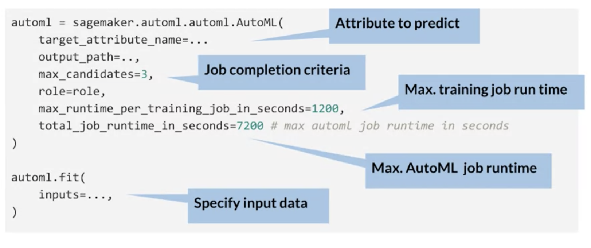
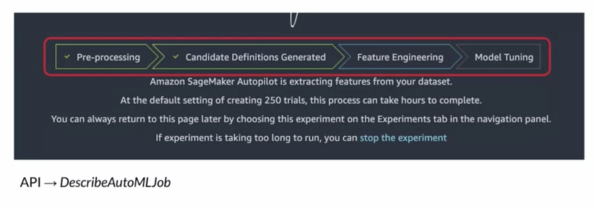

## AutoML

## WorkFlow

Ingest&Analyze:
- Problem Definition
- Algorithm Selection

Prepare&Transformation:
- Class imbalance: changing your performance metric, applying resampling techniques, generating synthetic data or even changing your selected algorithm, as an example. Xgboost tends to handle class imbalance well, but it also supports additional hyper parameter tuning to further tune for data imbalance
- Train-Validation Splits

Model Training: interative model tuning

Deploy&Manage

## Running experiments with Amazon SageMaker AutoPilot
Programmatically:
- AWS CLI
- AWS SDK
- Amazon SageMaker Python SDK
- SageMaker Studio

Launch the Amazon SageMaker Autopilot Job

Monitor Progress in Amazon SageMaker

## Evaluating output

## Model Host
Host a Model Endpoint:

Deploy Inference Pipelien:

Inference Pipelien:

