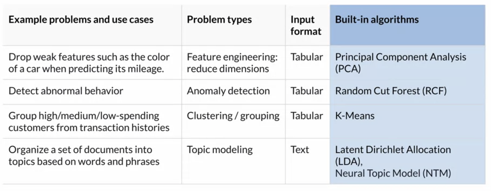
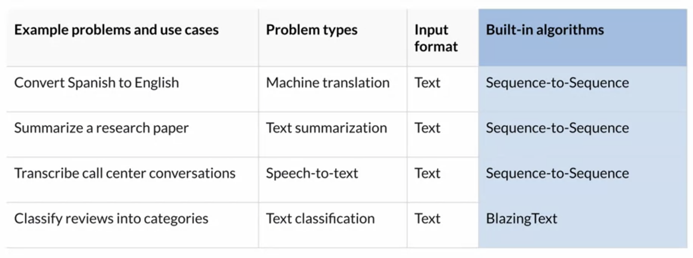

## Build-in Algorithm use cases
Regression&Logistic

Clustering

Image

Text

## Text Analysis
#### Word2Vec 2013
- Challenge:  out of the vocabulary, if the word is not found in the vocalulary, the model architecture assigns a zero to that word which is basically discarding the word

#### GloVe 2014: GloVe used the regression model to learn word representations through unsupervised learning

#### FastText 2016

#### Transformer 2017
The attention would map each word from the model's output to the words in the input sequence, assigning them weights depending on their importance towards the predicted word. 

The self attention mechanism in this new transformer architecture focuses on capturing the relationships between all words in the input sequence and thereby significantly improving the accuracy of natural language understanding tasks such as machine translation.

#### Blazing Text 2017

#### ELMo 2018
Word vectors are learned by a deep bidirectional language model. ELMO combines forward and backward language model and is thus able to better capture syntax and semantics across different linguistic contexts.

#### GPT
GPT is based on the transformer architecture but performs to training steps. First, GPT learns a language model from a large unlabeled text corpus, and second GPT performs a supervised learning step with labeled data to learn a specific NLP tasks such as tax classification. GPT is only trained and hands predicts context from left to right, which is often referred to as unique directional.

#### BERT
BERT, in contrast to GPT is truly bidirectional. In the unsupervised training step, BERD learns representations from unlabeled text, from left to right and right to left contexts

## Train a text classifier
Train and Tune

Deploy and Manage

