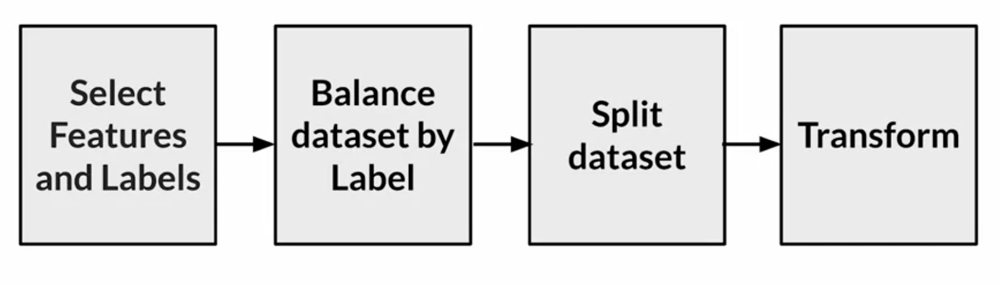
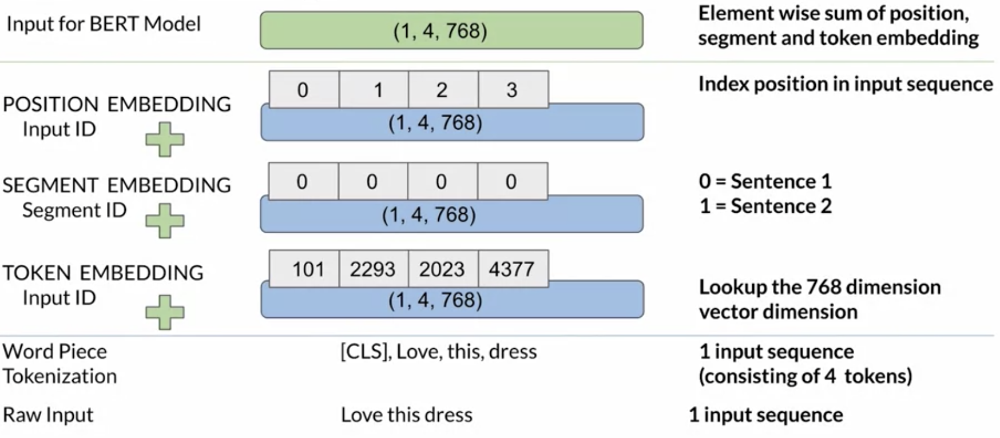
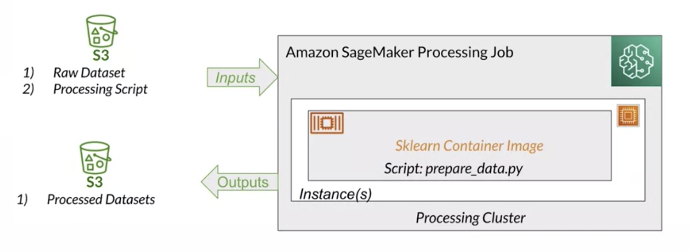
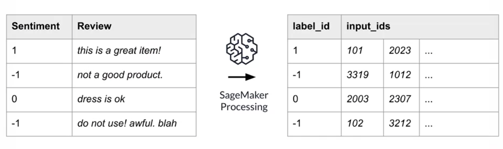
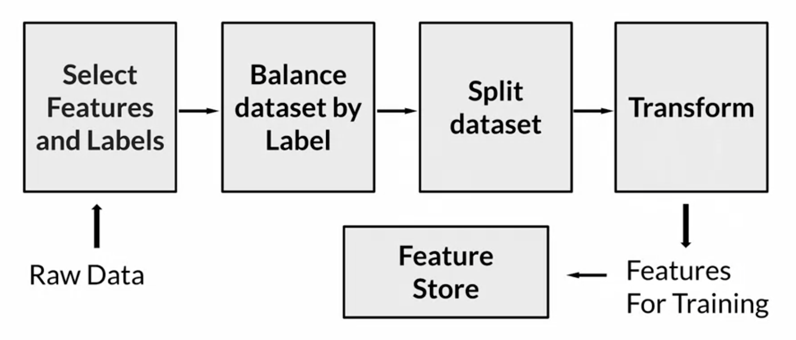
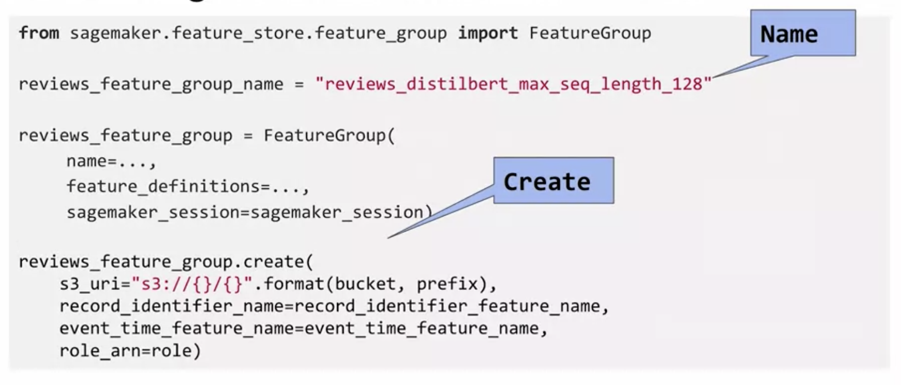
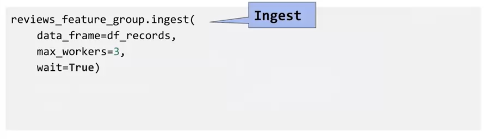
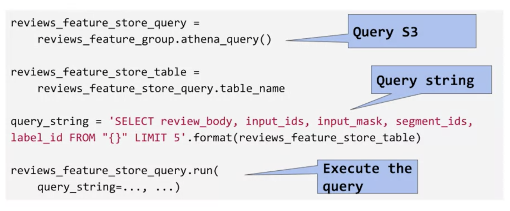

## Feature Engineering
Selection
- Identify: data attributes
- Filter: irrelevant and redundant attributes
  - Reduce feature dimensionality
  - Train models faster

Creation
- Combine: existing data points into new features
- Infer: new attributes
  - Lead to more accurate predictions

Transformation
- Impute: missing feature values
- Scale: numerical features
- Transform: non Numerical features

## Feature Engineering Pipeline

## BERT: Bidirectional Encoder Representations from Transformers

## SageMaker Processing
Execute preprocessing, post processing, model evaluation

## Feature Store

Feature store at a very high level is a repository, to store engineered features. For such a feature store, there are three high level characteristics that you want to consider. 
- First, you want the feature store to be **centralized** so that multiple teams can contribute their features to this centralized repository. 
- Second, you want the features from the feature store to be **reusable**. This is to allow reuse of engineered features, not just across multiple phases of a single machine learning project, but across multiple machine learning projects. A
- nd finally, you want the feature store to be **discoverable** so that any team member can come in and search for the features they want, and use the search results in their own machine learning projects. 

We can architect design and build such a feature store using mechanisms like a database for persistence and APIs for creating, retrieving, and deleting the features. Or, you can use a AWS tool like Amazon Sagemaker Feature Store, which is a managed service that provides a purpose belt, feature store.

#### create

#### ingest

#### retrieve

