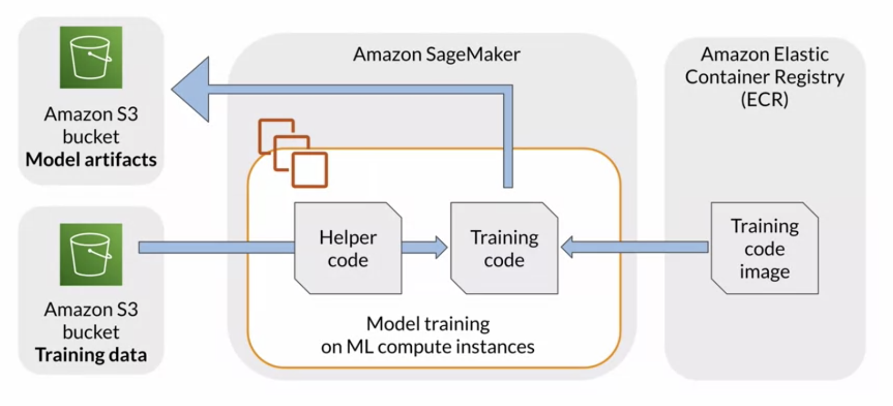

## Train and Debug a Custom Machine Learning Model

## Pre-trained models 
#### pre-trained vs build in
We learned how to use built in algorithms, for example the blazing text algorithm to quickly train a model. The built-in algorithm provided all required code to train the text classifier. We just point the algorithm to the prepared training data.

We'll work with pre trained models. The main difference here is that the model has already been trained on large collections of text data. we will provide the product previous data to adapt the model to your text domain and also provide your custom model training code.

#### model pre-training and fine tuning
Pre-trained and all key models have been trained on large text corpus such as large book collections or Wikipedia. In this **unsupervised learning** step, the model builds vocabulary of tokens from the training data and learns the vector representations. You can also pre train MLP models on specific language data.

Fine Tuning: we can use those pretrained models and simply adapt them to our specific data set, which is similar with the concept of transfer learning, which has become popular in computer vision. It's a machine learning technique where a model is trained on one task and then repurposed on a second related task.
- For example: If you work with English product reviews as your training data, you can use an English language model, pre trained, for example on Wikipedia and then find unit to the English product reviews. The assumption here is that the majority of words used in the product reviews have been learned already from the English Wikipedia
- Also we can train the model on your **specific NLP task**. In the product reviews example, adding a text classifier layer to the pre trained model that classifies the reviews into positive, neutral and negative sentiment classes.

Fine tuning is generally **faster** than pre training as the model doesn't have to learn millions or billions of BERT vector presentations. Also note that fine tuning is a **supervised learning** step as you fit the model using labeled training data. 

#### Some popular pretrained model
- Such as PyTorch, TensorFlow and Apache mxne have dedicated model where you can find pre trained models.
- The open source NLP project hugging face also provides an extensive model Hub with over 8000 pre trained NLP models. 

#### JumpStart: use SageMaker JumpStart to get easy access to pre trained text and vision models.
- JumpStart works with PyTorch Hub and TensorFlow Hub and lets you deploy supported models in one click into the SageMaker model hosting environment. JumpStart provides access to over a 100 pre trained vision models such as inception V3, ResNet 18 and many more. JumpStart also lists over 30 pre trained text models from PyTorch Hub and TensorFlow Hub, including a variety of BERT models.
-  JumpStart also provides a collection of solutions for popular machine learning use cases, such as for example fraud detection in financial transactions, predictive maintenance, demand, forecasting and prediction and more. When you choose a solution, JumpStart provides a description of the solution and the launch button, there is no extra configuration needed. Solutions launch all of the resources necessary to run the solution including training and model hosting instances. After launching the solution, JumpStart provides a link to a notebook that you can use to explore the solutions features
-  If you don't find a suitable model via a JumpStart, you can also pull in other pre trained models via custom code.

## BERT model pre-training and fine tuning
#### pre-training: unsupervised training, the input data is large collections of unlabeled text
- MLM: The model masks 15 percent of the words in each sentence. BERT then predicts the masked words and corrects itself, meaning it updates the model weights when it predicts incorrectly.
- NSP: BERT randomly chooses 50 percent of the sentence pairs and replaces one of the two sentences with a random sentence from another part of the document. BERT then predicts if the two sentences are a valid sentence pair or not.

#### fine-tuning: supervised training
In the fine-tuning step, we need configure the model for the actual NLP task, such as question and answer, text classification, or a named entity recognition. Fine-tuning is implemented as supervised learning and no masking or next sentence prediction happens. As a result, fine-tuning is very fast and requires a relatively small number of samples or product reviews.

## Train a custom model with Amazon SageMaker

#### Configure dataset and metrics

#### Configure model hyperparameters

#### Provide training script

#### Fit model

## Debug and Profile models

#### Detect common training errors
Vanishing or explode ingredients: 
- DNN learn through back propagation, in which the models losses trace back through the network. The neurons weights are modified in order to minimize the loss. If the network is too deep, however, the learning algorithm can spend its whole lost epoch on the top layers and weights in the lower layers, never get updated. That's the **vanishing gradient problem**. In return, the learning algorithm might trace a series of errors to the same neuron resulting in a large modification to that neurons wade that it imbalances the network. That's the **exploding gradient problem**.

Bad Initialization
- Initialization assigns random values to the model parameters. If all parameters have the same initial value, they received the same gradient and the model is unable to learn. Initializing parameters with values that are too small or too large may lead to vanishing or exploding gradients again.

Overfitting
- If the model's performance improves on a training set but not on a validation data set, it's a clear indication that the model is overfitting. If the model's performance initially improves on the validation set but then begins to fall off, training needs to stop to prevent the overfitting.

#### Monitor and profile system resource utilization
System resources can help you answer how many GPU, CPU, network and memory resources your model training consumes more. Specifically, it helps you to detect and alert you on bottlenecks so you can quickly take corrective actions. 

Here is an overview of potential bottlenecks. These could include I/O bottlenecks when loading your data. CPU or memory bottlenecks when processing the data and GPU bottlenecks or maybe underutilization during model training.

#### Analyze errors and take actions
- Stop model training when an issue is found
- Send notification iva email an issue is found
- Send a notification via text message when an issue is found

## Debug and Profile Models with Amazon SageMaker Debugger
#### Amazon SageMaker Debugger
Capture real-time dubugging data during model training in Amazon SageMaker
- System metrics
  - CPUT and GPU(and memory) utilization
  - Network metrics
  - Data input and output(I/O) metrics 
- Framework metrics
  - Convolutional opesrations in forward pass
  - Batch normalization operations in backward pass
  - Data loader processes between steps
  - Gradient descent algorithm operations
- Output tensors
  - Scalar values(accuracy and loss)
  - Matrics(weights, gradients, input layers, and output layers)

#### In code
Set up the rules and profiles then add to estimator, you can have a profiling report for which you could download while training or after training.
