## MLOps Overview
Path to production for ML models:
- Machine learning development != Software development lifecycle
- A model may be a small part of an overall solution
- Mutiple personas spanning the MLDC
- Integration with traditional IT practice

Path to Prod:
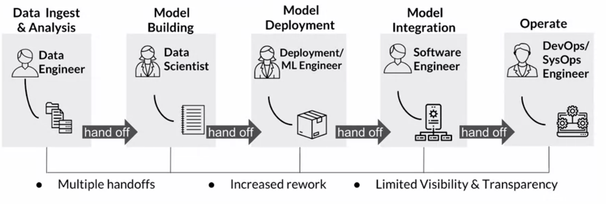
Accelerate Path to Prod:
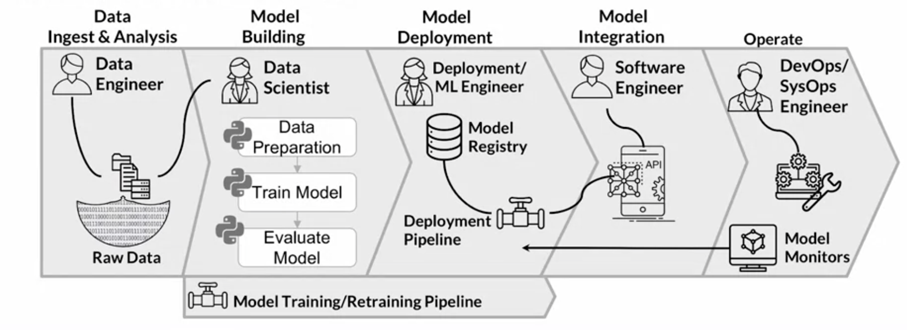
Automation vs Orchestration
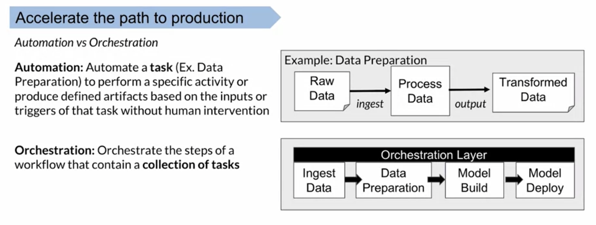
Improve the quality of deployed models
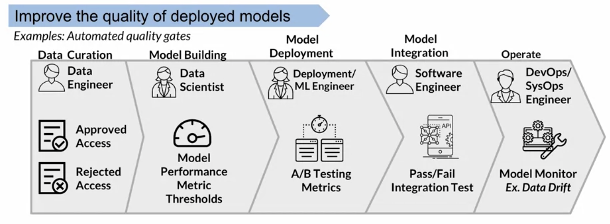
## Creating ML Pipelines
Ingest & Analyze:
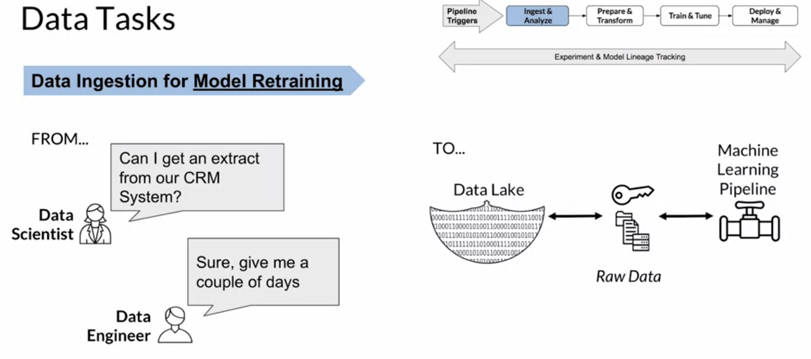

Prepare Transform:
- data preprocessing & feature engineering
- data versioning
- data validation(data quality, data schema, statistical bias)

Train & Tune:
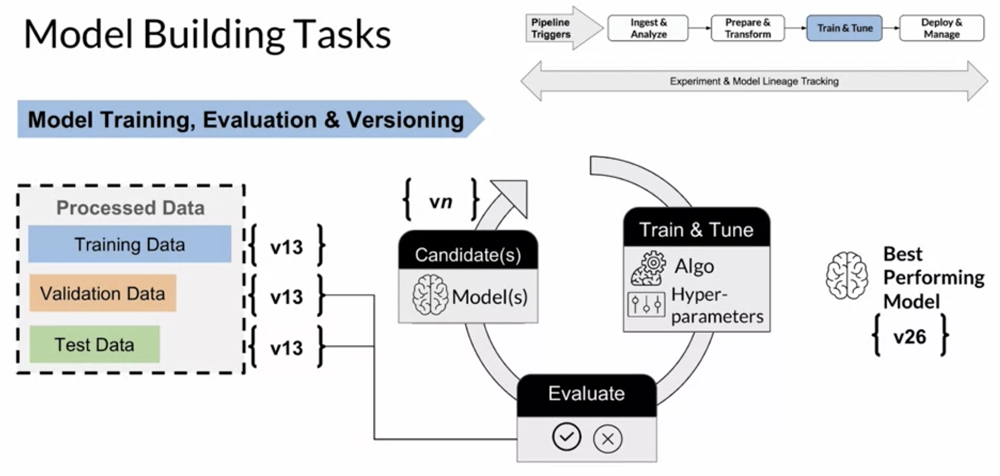

Deploy Models:
- model deployment & consumption
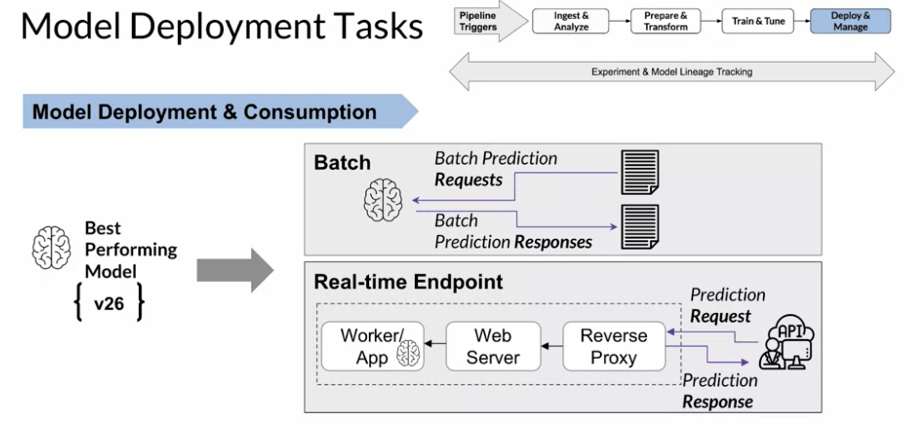
- logging & monitoring
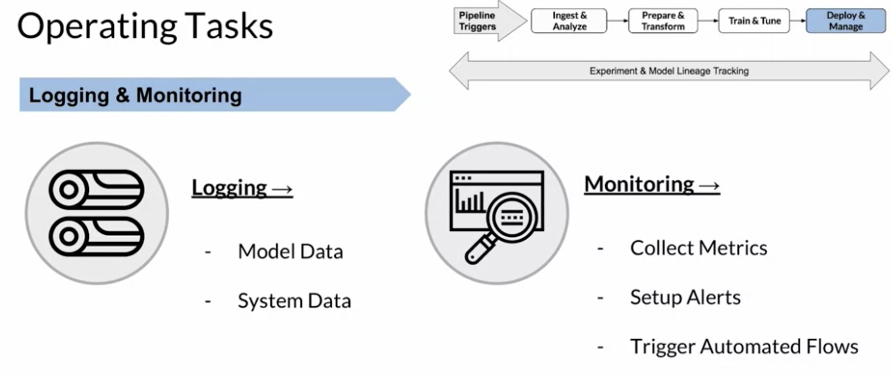
## Model Lineage & Artifact Tracking
Model Lineage:
- Model lineage essentially refers to understanding and tracking all of the inputs that were used to create a specific version of a model.
- For EACH version of a trained model: 
  - Versions of data used
  - Versions of code/hyperparameters used
  - Versions of algorithm/framework
  - Versions of training docker image
  - Versions of packages/libraries

Model Registry:
- A model registry is a central store for managing model metadata and model artifacts. 
- When you incorporate a model registry into your automated pipeline, it can provide traceability and auditability for your models, allowing you to effectively manage models, especially when you begin to manage at scale and you have tens or hundreds or even thousands of models.
- A model registry also gives you the visibility into how each of the model versions was built. It also typically includes other metadata, such as information about environments where a particular version of a model is deployed into. 
- Keep in mind though, that a model is one artifact that's produced as part of your machine learning pipelines. There's other outputs and artifacts that are produced that you also want to consider for complete end-to-end traceability. 

Aritifacts:
- Artifacts can be the output of a step or a task that can be consumed by the next step in your pipeline. Or they can even be deployed directly for consumption by other applications or systems.
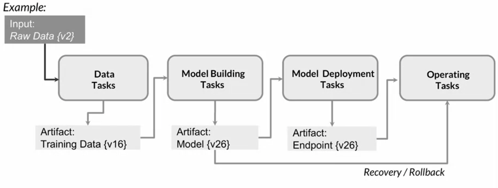

## Amazon SageMaker Pipelines
SageMaker Pipelines has 3 components:
- pipeline, model registry, project
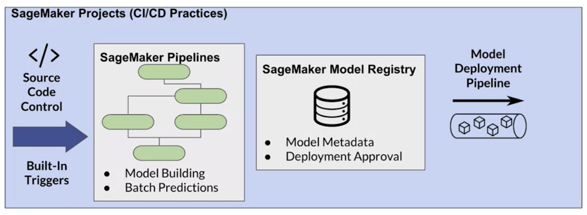

Pipelines:
- Create pipelines to build and evaluate models
- Python SDK for building workflows
- Pipeline visualization available through Amazon SageMaker Studio
- Fully managed pipelines-no servers to manage

Model Registry:
- Catalog models for production
- Manage model versions & metadata
- Manage the approval status of a model
- Trigger model deployment pipeline

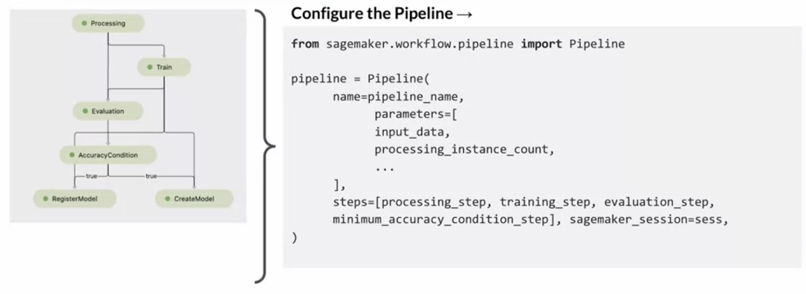
