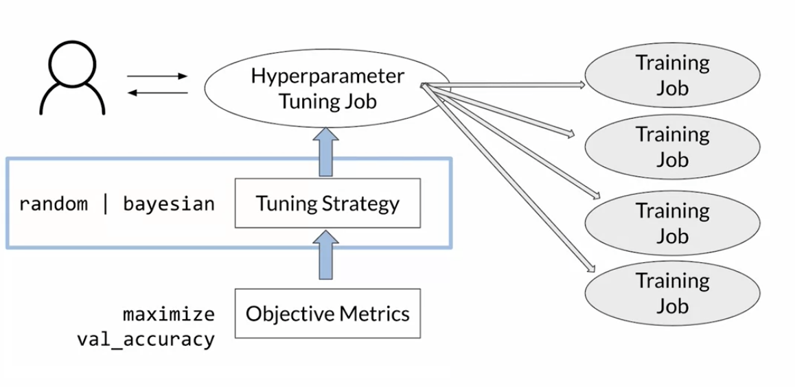
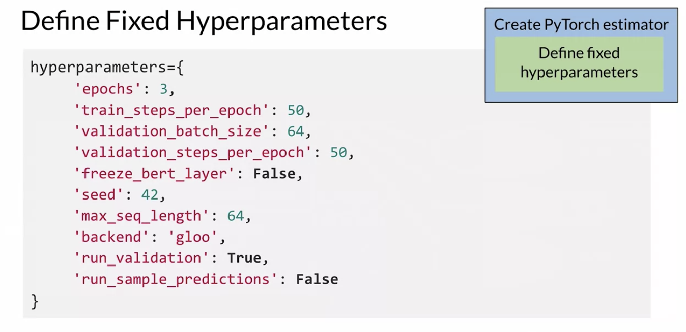
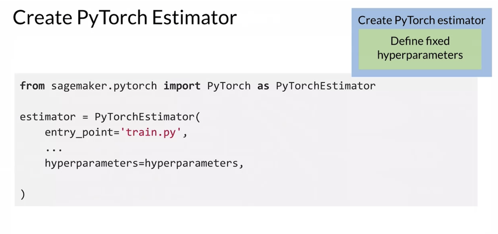
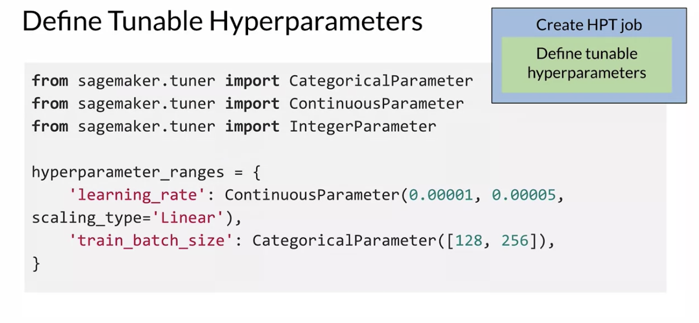
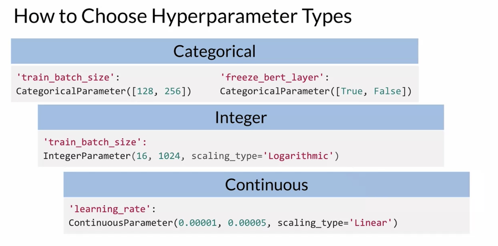
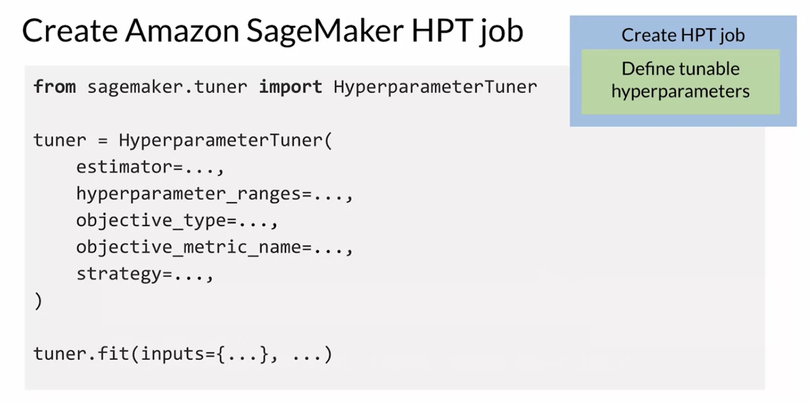
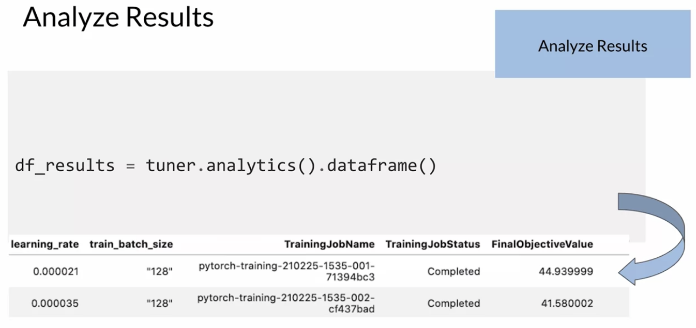

## Advanced Model Traning and Tuning
#### Popular Algorithms for Automatic Model Tuning
Grid search
- Define sets of hyperparameters
- Test **every** combination
- Select the best performing hyperparameters
- **Doesn't scale to large numbers of parameters**

Random search
- Define sets of hyperparameters
- Define search speace and stop criteria
- Test random combination within search space
- Select the best performing hyperparameters
- **Faster but might miss better performing hyperparameters**

Bayesian optimization
- Treat HPT like a regression problem(surrogate model)
- Start from random hyperparameters
- Narrow down searh space around better performing hypterparameters
- **More efficient in finding best hyperparameters**
- **Requires sequential execution**
- **Might get stuck in local minima**

Hyperband
- Bandit-based approach
- Start from random hyperparameters
- Explore sets of hyperparameters for few iterations
- Choose best and explore longer
- Repeat until max_iterations reched or one candidate left
- **Spend time efficient, might discard good candidates early that converge slowly**

#### AWS SageMaker Hyperparamter Tuning(HPT)

#### Steps
Create PyTorch Estimator

Create HPT Job

Analyze Results

#### Warm Start HPT Job
A warm start is particularly useful if you want to change the hyperparameter tuning ranges from the previous job, or if you want to add new hyperparameters to explore. Both these situations can use the knowledge from the previously completed job to speed up the process and find the best model quickly.

There're two types:
- Identical data and algorithm 
  - Same input data and training data
  - Update hyperparameter tuning ranges and maxium number of training jobs
- Transfer_learning
  - Updated training data and different versin of training algorithm

Best Practices-SageMaker HPT
- Select a small number of hyperparameters
- Select a small range for hyperparameters
- Enable warm start
- Enable early stop to save tuning time and costs
- Select small number of concurrent training jobs

Best Practices-Monitoring Training Resourses
- Right size compute resources
- Require empirical testing
- Amazon CW metrics
- Insights from Amazon SageMaker Debugger
