## Advanced model deployment and monitoring
### Model Deployment Overview
Deployment options
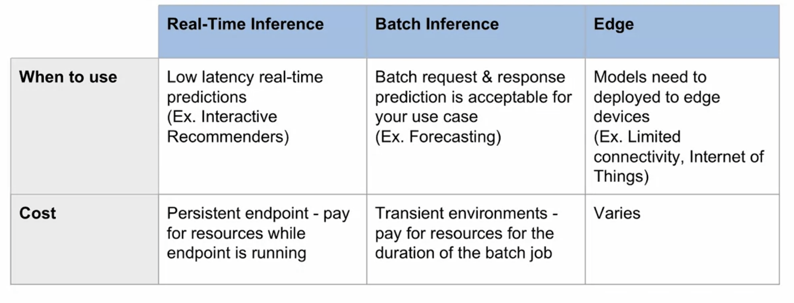

### Model Deployment Strategies
Blue/Green: shift all traffic to the new model
- Swap prediction request traffic
- Easy Rollback
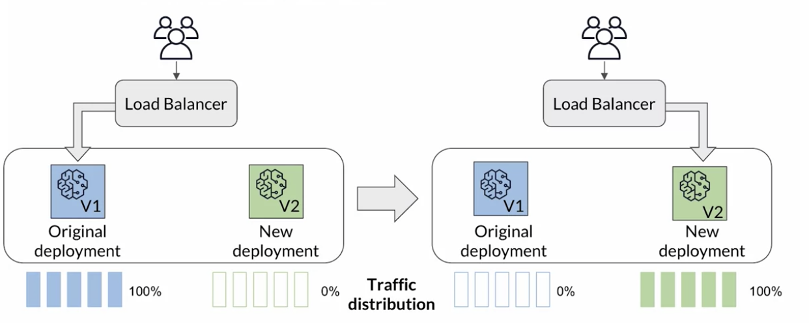

Shadow/Challenger: run multiple versions in parallel with one serving live traffic
- Parallel prediction request traffic
- Validate new version without impact
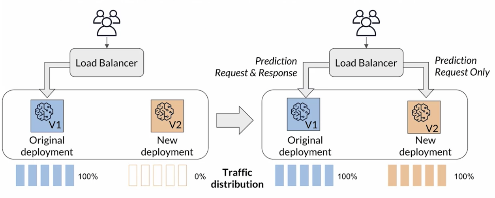

Canary: split traffic to compare model versions with target groups/users
- Split traffic
- Target smaller special userssss/groups
- Shorter validation cycles
- Minimize risk of low performing model
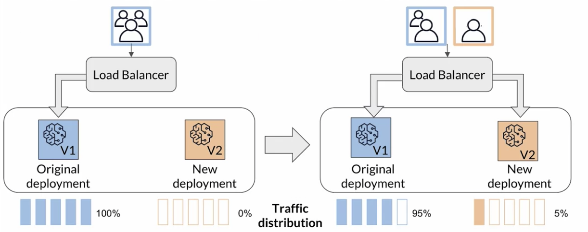

A/B
- Split traffic
- Target larger users/groups OR distribute % of traffic
- Longer validation cycles
- Minimize risk of low performing models

Multi-Armed Bandits (Dynamic Approach): Multi-armed bandits use reinforcement learning as a way to dynamically shift traffic to the winning model versions by rewarding the winning model with more traffic but still exploring the nonwinning model versions in the case that those early winners were not the overall best models. 
- Dynamic testing method for model version using Reinforcement learning
- Exploit & Explore
  - Exploit: reward the winning model with more traffic
  - Explore: continue to send traffic the the non-winning models in case behavior changes
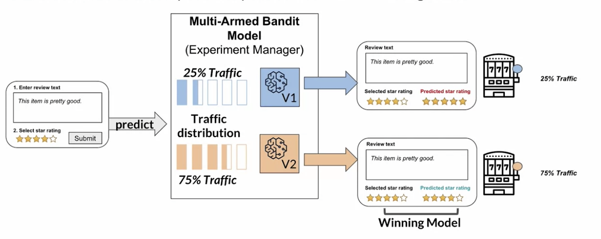

### Amazon SageMaker Hosting: Real-Time Inference
Deploy models to serve predictions in real-time
- Optimized for low latency of model predictions
- Example: as product reviews are coming in through channels, you want to predict sentiment for immediate actions

#### Build in Algorithm: pre build code & serving container
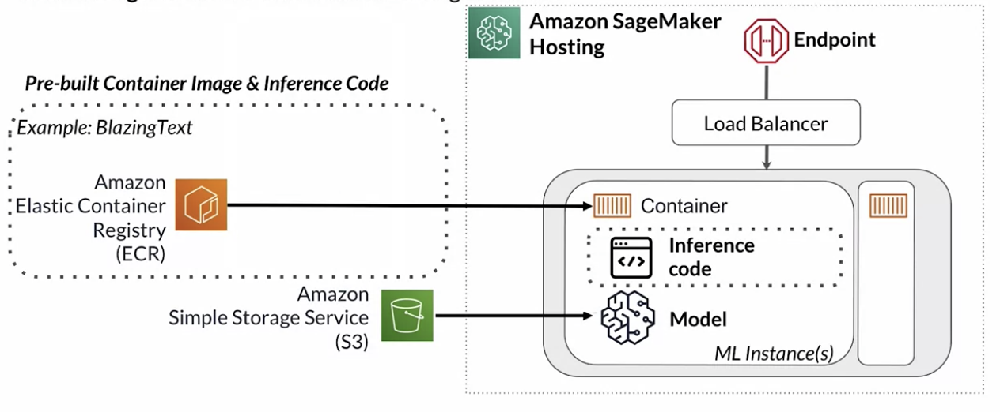
#### Bring your own container: bring your own code & custom container
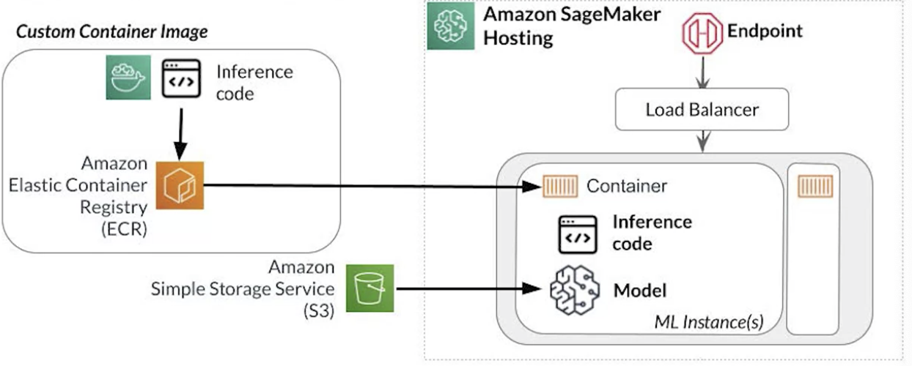
#### Autoscaling Endpoints: allows you to scale the number of machine learning instances that are hosting your endpoints up or down based on your workload demands.
- Ensure you can meet the demands of your workload
- Cost optimization

#### Multi-Model Endspoints: host multiple models behind a single endpoint
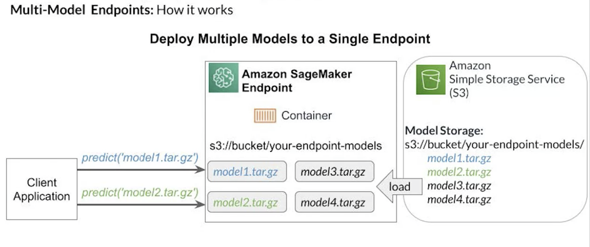
#### Inference Pipeline:
Inference pipeline allows you to host multiple models behind a single endpoint. But in this case, the models are sequential chain of models with the steps that are required for inference. This allows you to take your data transformation model, your predictor model, and your post-processing transformer, and host them so they can be sequentially run behind a single endpoint.
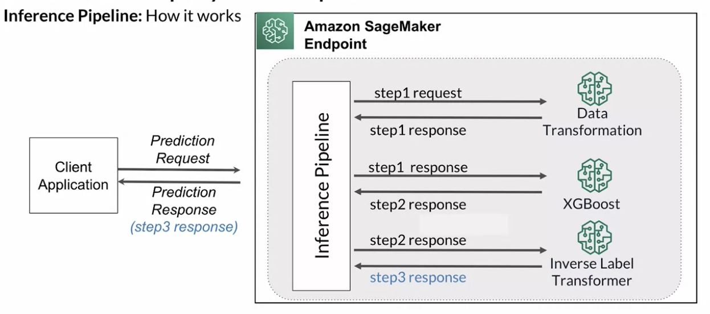

### Amazon SageMaker: Real-time Inference Production Variants
Product Variant:
A production variant is a package SageMaker model combined with the configuration that defines how that model will be hosted.

### Amazon SageMaker Batch Transform: Batch Inference
Package model
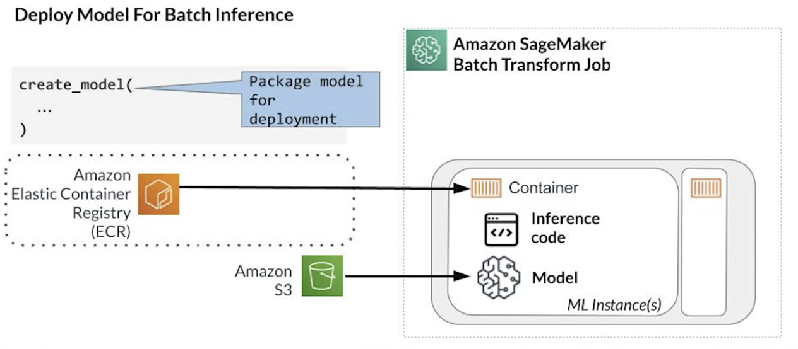
Configure batch transformer job

Start batch transform job

### Model Integration: prepare data for inference in client application
Implement data transformations in client application
- difficult to scale and mange
- response may need to be transformed (1=>positive)
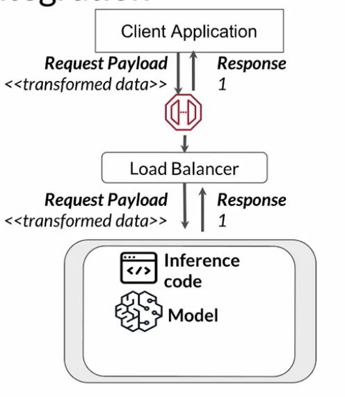

Implement transformations code before calling hosted model
- need to ensure tranformation code stays in sync with training code
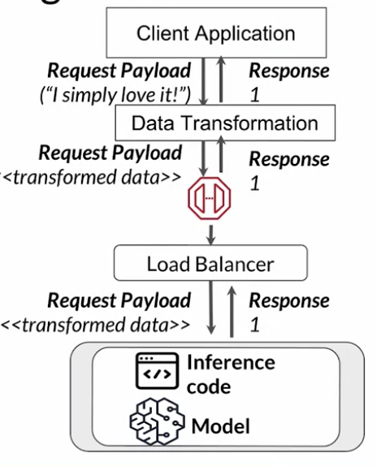

Implement data transformers in Inference Pipeline
- keep training and inference code in sync
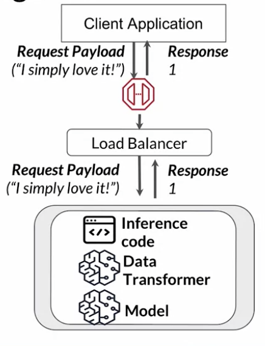

### Monitoring ML Workloads
#### Why model monitoring: model degrade over time
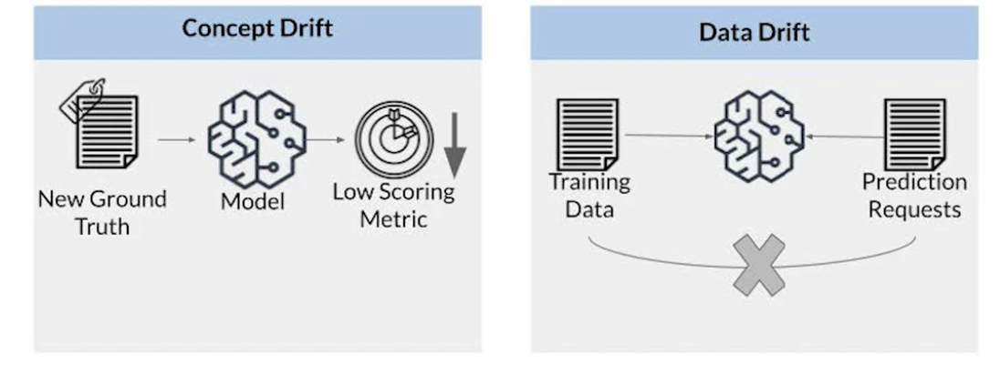
- Concept Drift
- Data Drift
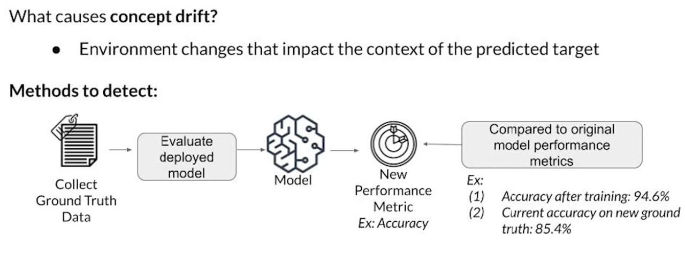
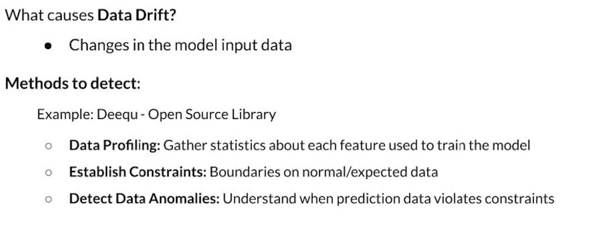

#### System monitoring: ensure your model and supporting resources are functioning as expected
- eg model latency, system metrics, ml pipeline

#### Monitoring Impact on Business Objectives: ensure your model ahs impact on business object

### Model Monitoring using Amazon SageMaker Model Monitor

Data Quality Monitor
- Monitor when inference data drifts away from baseline(training) data
- Model Monitor uses, Deequ, an open source libaray built on Apache Spark

Model Quality Monitor
- Monitor model quality by comparing model predictions with ground truth labels

Statistical Bias Drift
- Monitor predictions for statistical bias
- Amazon SageMaker Clarify integrates with Amazon SageMaker Model Monitor to detect statistical bias drift

Feature Attribution Monitor
- Monitor features contributing to predictions over time
- Amazon SageMaker Clarify Clarify integrates with Amazon SageMaker Model Monitor to detect feature attribution drift
- Utilizes SHAP for baselining