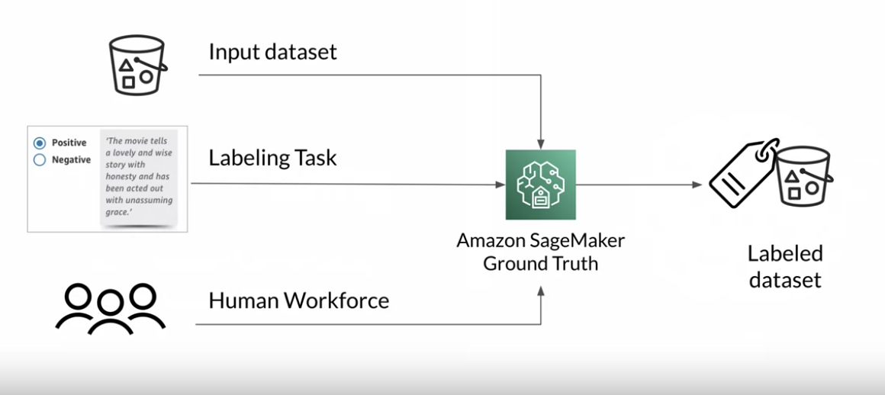
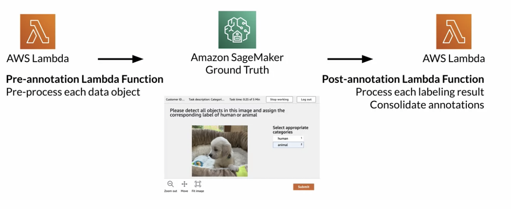
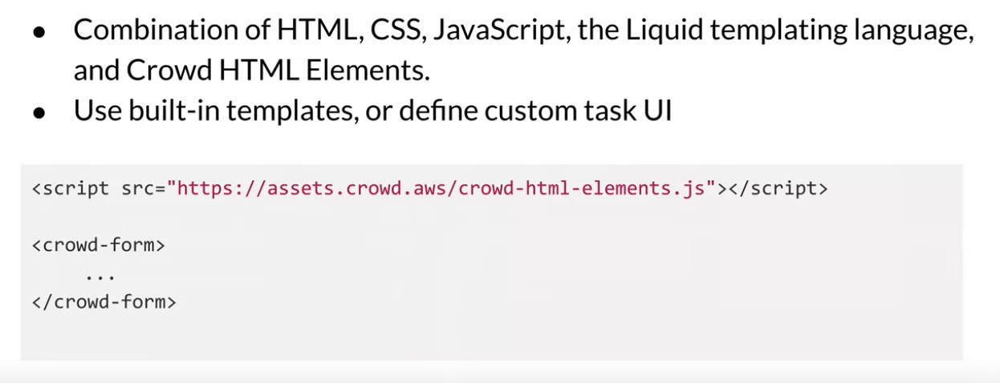
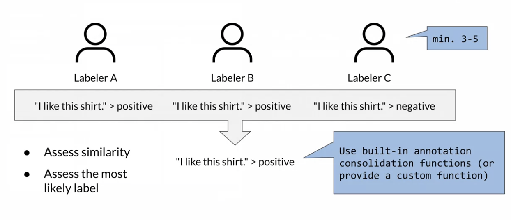
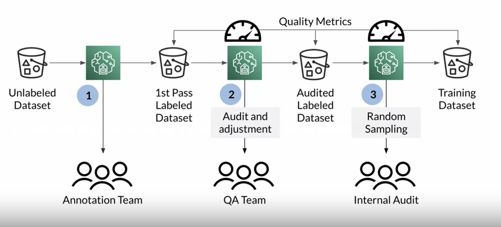
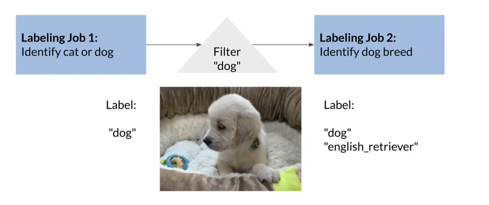
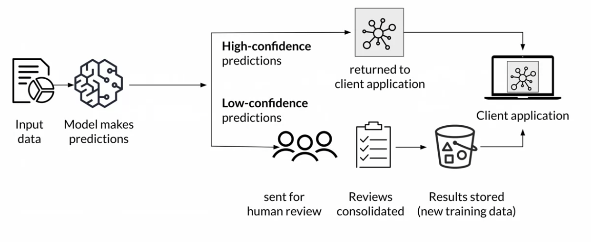
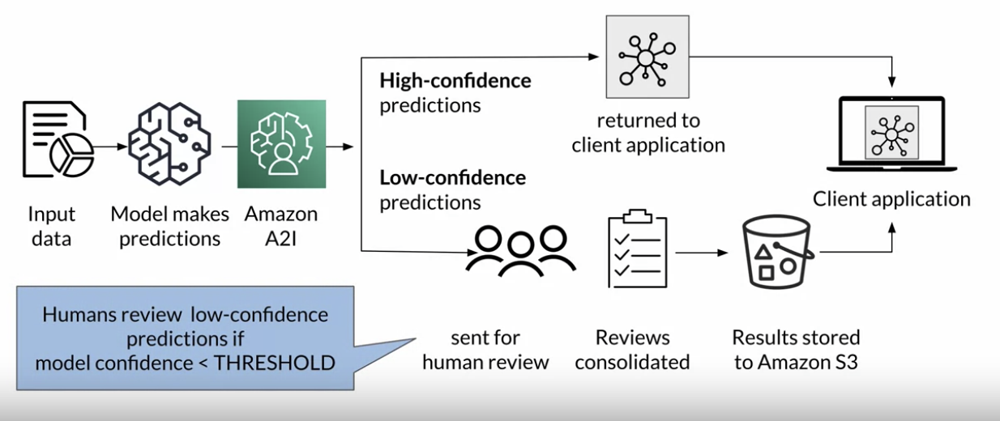

## Data Labeling
### Data Labeling with Amazon SageMaker Ground Truth

Setup Input Data
- Automated data setup: provide the s3 location of the dataset you want labeled
- Manual data setup: provide the s3 location of a file(an input manifest file) that identifies the data objects you want labeled

Select Labeling Task
- Image. video, text, custom

Custom Labeling Task

Human Workforce Options: amazon mechanical turk, private, vendor

Human Task UI

### Data Labeling Best Practices
Best Practice
- Provide clear instructions
- Consolidate annotation to imrpve label quality: If you send the same task to more than one worker, you need to implement a method for consolidating the annotations. 

- Verify and adjust labels

- Use automated data labeling on large dataset (active learning)

- Reuse prior labeling jobs to create hierarchical labels

### Human-In-The-Loop Pipelines
Some machine learning applications need human oversight to ensure accuracy with sensitive data to help provide continuous improvements and retrain models with updated predictions. Integrating machine learning systems into your workflow while keeping a human eye on the results to provide a required level or position. This concept is called human-in-the-loop pipelines. You can allow human reviewers to step in when a model is unable to make a high confidence prediction, or to audit its prediction on an ongoing basis. 

### Human-In-The-Loop Pipelines with Amazon Augmented AI (Amazon A2I))
Amazon A2I makes it easy to build and manage human reviews for machine learning applications. Amazon A2I provides built-in human review workflows for common machine learning use cases such as text extraction from documents, which allows predictions from, for example, Amazon Textract to be reviewed easily. You can also create your own workflows for machine-learning models built on SageMaker or any other tools.

